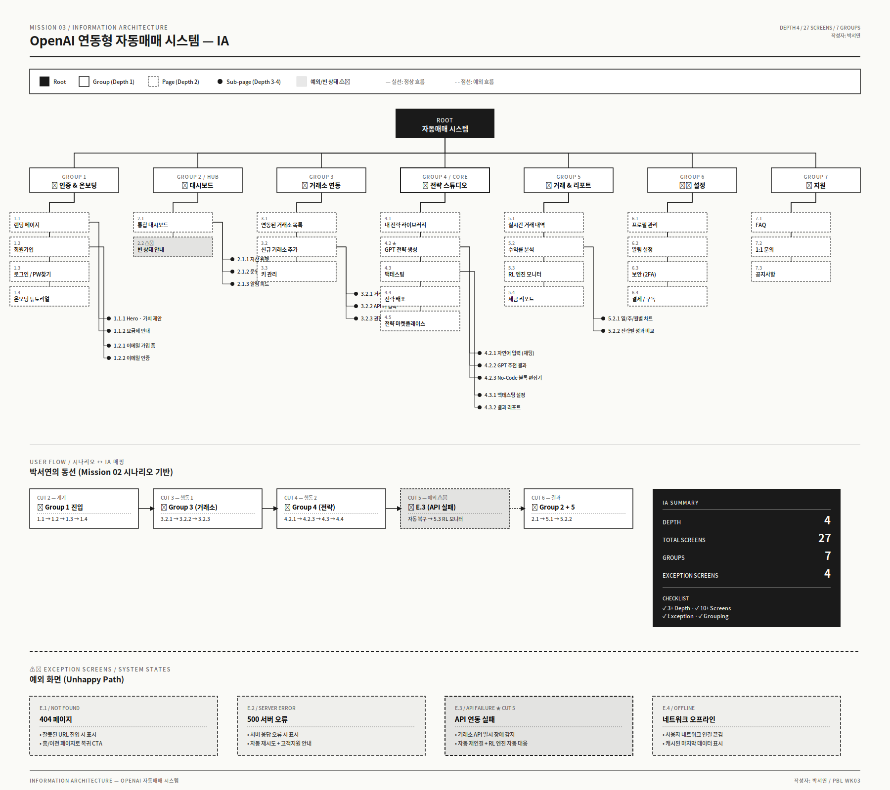
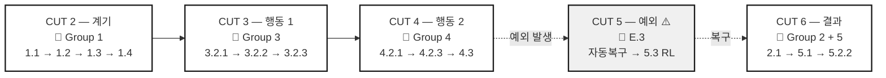

# 🤖 OpenAI 연동형 자동매매 시스템 — IA (정보 구조)

GPT와 강화학습 기반으로 코딩 없이 나만의 투자 전략을 만들고,
여러 거래소에서 자동으로 매매해주는 AI 트레이딩 플랫폼의 정보 구조입니다.

---

## 📌 프로젝트 개요

| 항목 | 내용 |
|---|---|
| 서비스명 | OpenAI 연동형 자동매매 시스템 |
| 타겟 페르소나 | 박서연 (27, UX 디자이너 / 코인 투자 1년차) |
| 핵심 가치 | No-Code 전략 생성 · 비수탁형 자산 관리 · 강화학습 기반 적응 |
| 총 화면 수 | **27개** (메인 23 + 예외 4) |
| 계층 깊이 | **Depth 4** |

---

## 🌳 IA 다이어그램

> 📥 [SVG 파일 다운로드](./ia-diagram.svg) (Figma 드래그용)

---

## 🗂 IA 트리 구조 (Mermaid)

```mermaid
graph TD
    Root["🏠 자동매매 시스템 Root"]

    Root --> G1["🚪 1. 인증 & 온보딩"]
    Root --> G2["📊 2. 대시보드"]
    Root --> G3["🔗 3. 거래소 연동"]
    Root --> G4["🧠 4. 전략 스튜디오 ★"]
    Root --> G5["📈 5. 거래 & 리포트"]
    Root --> G6["⚙️ 6. 설정"]
    Root --> G7["💬 7. 지원"]
    Root --> EX["⚠️ 예외 화면"]

    G1 --> P11["1.1 랜딩 페이지"]
    G1 --> P12["1.2 회원가입"]
    G1 --> P13["1.3 로그인/PW찾기"]
    G1 --> P14["1.4 온보딩 튜토리얼"]
    P11 --> P111["1.1.1 Hero · 가치 제안"]
    P11 --> P112["1.1.2 요금제 안내"]
    P12 --> P121["1.2.1 이메일 가입 폼"]
    P12 --> P122["1.2.2 이메일 인증"]

    G2 --> P21["2.1 통합 대시보드"]
    G2 --> P22["2.2 빈 상태 안내 ⚠️"]
    P21 --> P211["2.1.1 자산 위젯"]
    P21 --> P212["2.1.2 운영중 전략"]
    P21 --> P213["2.1.3 알림 피드"]

    G3 --> P31["3.1 연동된 거래소 목록"]
    G3 --> P32["3.2 신규 거래소 추가"]
    G3 --> P33["3.3 키 관리"]
    P32 --> P321["3.2.1 거래소 선택"]
    P32 --> P322["3.2.2 API 키 입력"]
    P32 --> P323["3.2.3 권한 검증"]

    G4 --> P41["4.1 내 전략 라이브러리"]
    G4 --> P42["4.2 GPT 전략 생성 ★"]
    G4 --> P43["4.3 백테스팅"]
    G4 --> P44["4.4 전략 배포"]
    G4 --> P45["4.5 전략 마켓플레이스"]
    P42 --> P421["4.2.1 자연어 입력"]
    P42 --> P422["4.2.2 GPT 추천 결과"]
    P42 --> P423["4.2.3 No-Code 블록 편집기"]
    P43 --> P431["4.3.1 백테스팅 설정"]
    P43 --> P432["4.3.2 결과 리포트"]

    G5 --> P51["5.1 실시간 거래 내역"]
    G5 --> P52["5.2 수익률 분석"]
    G5 --> P53["5.3 RL 엔진 모니터"]
    G5 --> P54["5.4 세금 리포트"]
    P52 --> P521["5.2.1 일/주/월별 차트"]
    P52 --> P522["5.2.2 전략별 성과 비교"]

    G6 --> P61["6.1 프로필 관리"]
    G6 --> P62["6.2 알림 설정"]
    G6 --> P63["6.3 보안 2FA"]
    G6 --> P64["6.4 결제 / 구독"]

    G7 --> P71["7.1 FAQ"]
    G7 --> P72["7.2 1:1 문의"]
    G7 --> P73["7.3 공지사항"]

    EX --> E1["E.1 404 Not Found"]
    EX --> E2["E.2 500 Server Error"]
    EX --> E3["E.3 API 연동 실패 ⚠️"]
    EX --> E4["E.4 네트워크 오프라인"]

    classDef rootStyle fill:#1a1a1a,stroke:#1a1a1a,color:#fff
    classDef groupStyle fill:#fff,stroke:#1a1a1a,stroke-width:2px,color:#1a1a1a
    classDef coreStyle fill:#1a1a1a,stroke:#1a1a1a,color:#fff
    classDef exceptionStyle fill:#f0f0f0,stroke:#1a1a1a,color:#1a1a1a

    class Root rootStyle
    class G1,G2,G3,G5,G6,G7 groupStyle
    class G4 coreStyle
    class EX,E1,E2,E3,E4,P22 exceptionStyle
```

---

## 🔄 사용자 동선 매핑 (시나리오 ↔ IA)

---

## 📋 페이지별 핵심 기능 명세

### 1. 🚪 인증 & 온보딩

| ID | 화면 | 핵심 기능 |
|---|---|---|
| 1.1.1 | 서비스 소개 (Hero) | 핵심 가치 제안, CTA 버튼 |
| 1.1.2 | 요금제 안내 | Free/Pro/Enterprise 플랜 비교 |
| 1.2.1 | 이메일 가입 폼 | 이메일·비밀번호·약관 동의 |
| 1.2.2 | 이메일 인증 | 인증 코드 확인 |
| 1.3 | 로그인 | 이메일 로그인, 소셜 로그인(Google) |
| 1.4 | 온보딩 튜토리얼 | 4-step 서비스 사용법 가이드 |

### 2. 📊 대시보드

| ID | 화면 | 핵심 기능 |
|---|---|---|
| 2.1.1 | 자산 현황 위젯 | 거래소별 자산 통합 표시 |
| 2.1.2 | 운영중 전략 요약 | 활성 전략 ON/OFF 토글 |
| 2.1.3 | 실시간 알림 피드 | 최근 거래·시스템 알림 |
| 2.2 | **빈 상태 안내** ⚠️ | 전략이 0개일 때 가이드 표시 |

### 3. 🔗 거래소 연동

| ID | 화면 | 핵심 기능 |
|---|---|---|
| 3.1 | 연동 목록 | 연결된 거래소 카드형 표시 |
| 3.2.1 | 거래소 선택 | 업비트/바이낸스/Bybit 선택 |
| 3.2.2 | API 키 입력 | API Key, Secret 안전 입력 |
| 3.2.3 | 권한 검증 | 읽기·매매 권한 확인 |
| 3.3 | 키 관리 | 재발급, 삭제, 권한 변경 |

### 4. 🧠 전략 스튜디오 ★ (핵심)

| ID | 화면 | 핵심 기능 |
|---|---|---|
| 4.1 | 내 전략 라이브러리 | 저장된 전략 카드 그리드 |
| 4.2.1 | GPT 자연어 입력 | 채팅 UI로 전략 요청 |
| 4.2.2 | GPT 추천 결과 | 생성된 전략 미리보기 |
| 4.2.3 | No-Code 블록 편집기 | 트리거·액션·손절 블록 편집 |
| 4.3.1 | 백테스팅 설정 | 기간·종목·초기자본 설정 |
| 4.3.2 | 백테스팅 결과 | 수익률·MDD·승률 리포트 |
| 4.4 | 전략 배포 | 실거래 활성화 + 자본 배분 |
| 4.5 | 전략 마켓 | 다른 사용자 전략 둘러보기 |

### 5. 📈 거래 & 리포트

| ID | 화면 | 핵심 기능 |
|---|---|---|
| 5.1 | 실시간 거래 내역 | 매수·매도 타임라인 |
| 5.2.1 | 일/주/월별 차트 | 기간별 수익률 시각화 |
| 5.2.2 | 전략별 성과 비교 | 다중 전략 성과 대시보드 |
| 5.3 | RL 엔진 모니터 | 강화학습 학습 상태·시장 적응도 |
| 5.4 | 세금 리포트 | CSV 다운로드 (양도소득세 대비) |

### 6. ⚙️ 설정

| ID | 화면 | 핵심 기능 |
|---|---|---|
| 6.1 | 프로필 관리 | 닉네임·아바타·언어 |
| 6.2 | 알림 설정 | 채널별 ON/OFF 세부 설정 |
| 6.3 | 보안 | 2FA, 비밀번호 변경, 세션 관리 |
| 6.4 | 결제 / 구독 | 카드 등록, 플랜 변경, 청구 내역 |

### 7. 💬 지원

| ID | 화면 | 핵심 기능 |
|---|---|---|
| 7.1 | FAQ | 카테고리별 자주 묻는 질문 |
| 7.2 | 1:1 문의 | 티켓 생성·응답 확인 |
| 7.3 | 공지사항 | 업데이트·점검 안내 |

### ⚠️ 예외 화면

| ID | 화면 | 핵심 기능 |
|---|---|---|
| E.1 | 404 Not Found | 잘못된 경로 안내 + 홈 이동 |
| E.2 | 500 Server Error | 서버 오류 + 자동 재시도 |
| E.3 | **API 연동 실패** | CUT 5 시나리오 — 재연결 시도, RL 엔진 자동 대응 표시 |
| E.4 | 네트워크 오프라인 | 캐시된 데이터 표시, 재접속 안내 |

---

## 🧭 그룹핑 논리 (사용자 동선 기반)

| 그룹 | 사용 빈도 | 사용자 멘탈 모델 | 동선상 위치 |
|---|---|---|---|
| 1. 인증 & 온보딩 | 1회성 | "시작하기" | 외부 → 내부 진입점 |
| 2. 대시보드 | **매일** | "지금 상태 확인" | 메인 허브 (홈) |
| 3. 거래소 연동 | 초기 1회 + 가끔 | "내 자산 연결" | 설정 직전 단계 |
| 4. 전략 스튜디오 | **자주** | "전략 만들기" | 핵심 작업 공간 |
| 5. 거래 & 리포트 | **매일** | "결과 보기" | 대시보드 심화 |
| 6. 설정 | 가끔 | "내 정보 관리" | 우측 상단 진입 |
| 7. 지원 | 문제 발생 시 | "도움 필요" | 푸터/우하단 |

### 📐 동선 설계 원칙
1. **3-Click Rule** — 핵심 기능(전략 생성, 거래 내역)은 홈에서 3클릭 이내 접근
2. **빈도순 배치** — 좌측 사이드바 상단부터: 대시보드 → 전략 → 거래 → 거래소 → 설정
3. **위험 격리** — API 키 관리, 결제는 2FA 재인증 후 접근
4. **실패 가시성** — 예외 화면(E.3)은 단순 에러가 아닌 시스템의 자동 대응 과정을 보여줌

---

## ✅ 체크리스트 충족 현황

- [x] 시나리오 기반으로 필요한 페이지가 빠짐없이 도출됨
- [x] **Depth 4 계층 구조** (Root → Group → Page → Sub-page)
- [x] **27개 화면** 포함 (10개 이상)
- [x] 각 노드에 화면 이름과 핵심 기능 표기
- [x] 7개 그룹으로 논리적 그룹핑
- [x] 메뉴 그룹핑이 사용자 동선(빈도/멘탈모델) 고려
- [x] **4개 예외 화면** 포함 (E.1~E.4)
- [x] README에 작성자 이름 포함 (박서연)

---

## 📎 관련 문서

- Mission 01: 서비스 정의 & 페르소나
- Mission 02: 사용자 시나리오 보드
- **Mission 03: IA (현재 문서)**

---
