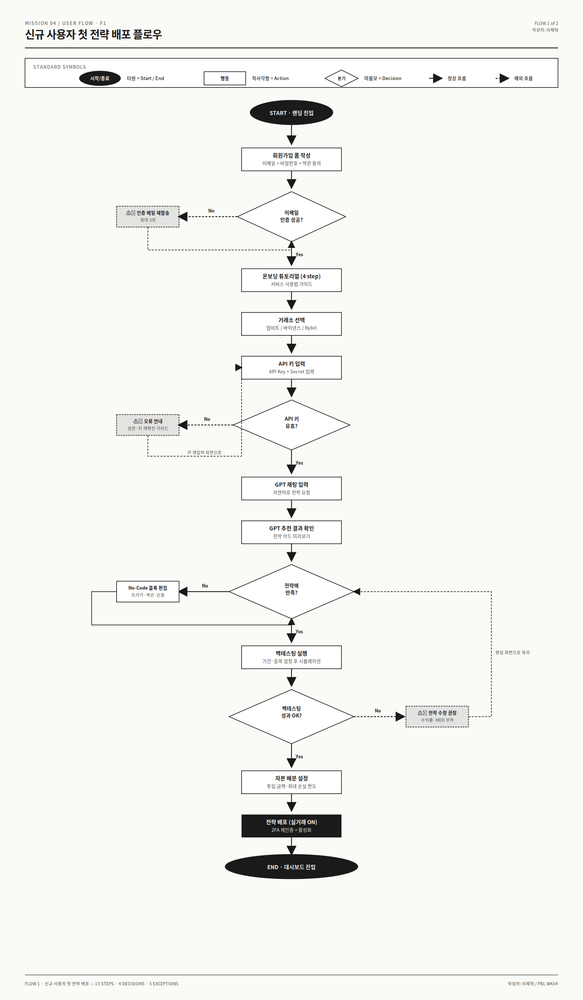
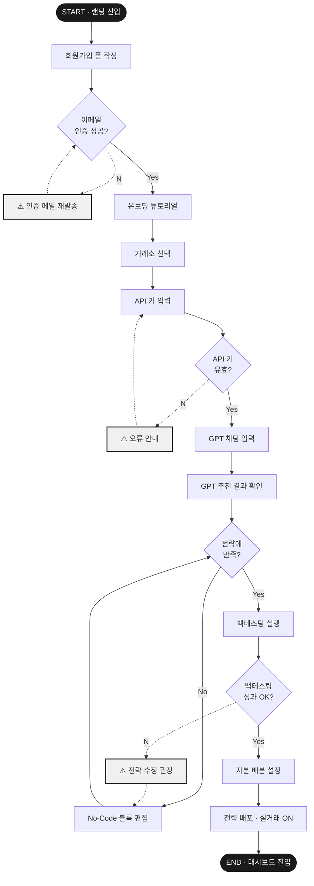
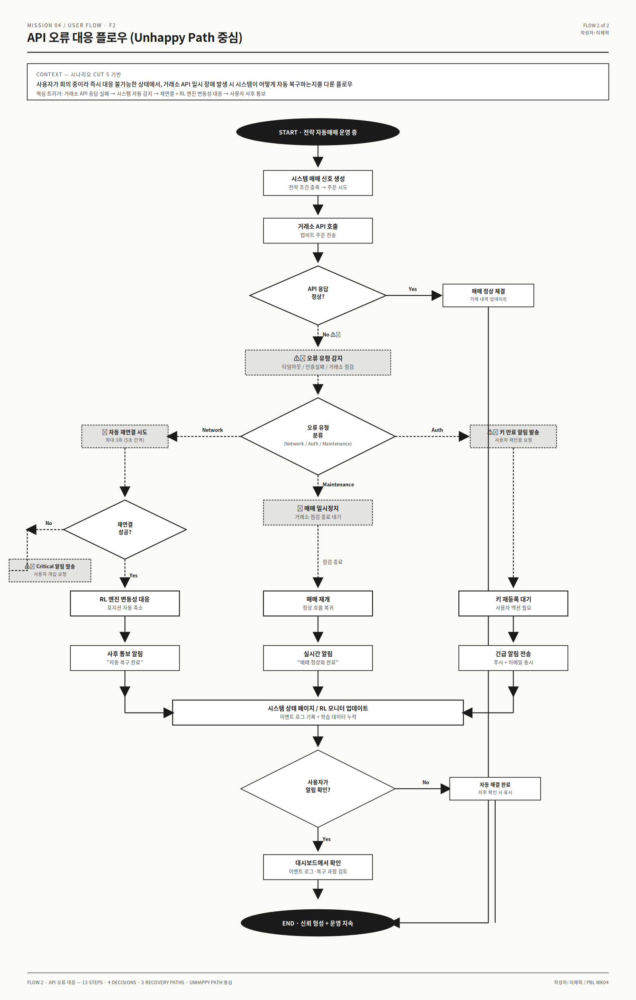
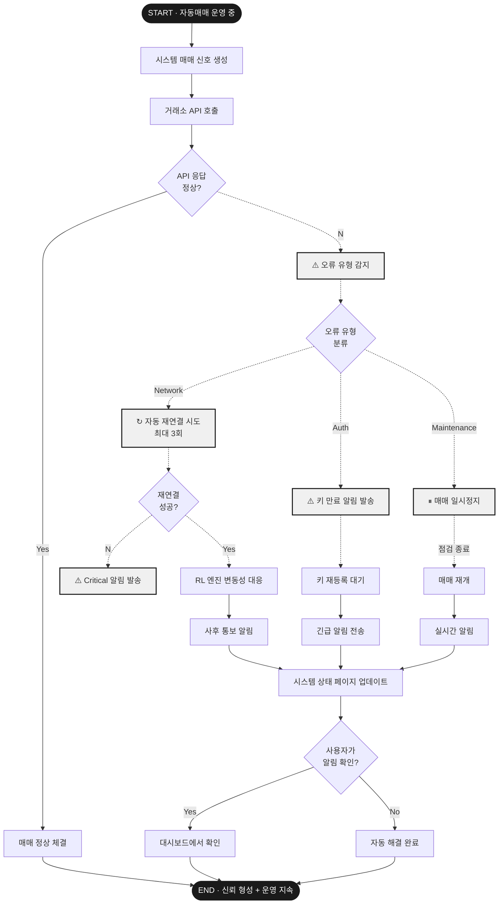
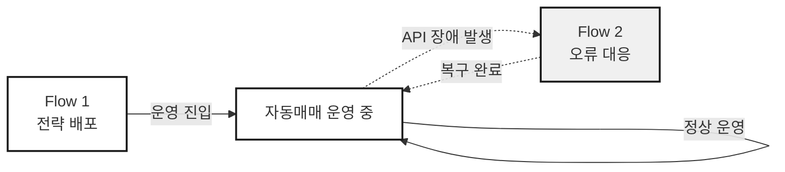

# 🔀 OpenAI 연동형 자동매매 시스템 — User Flow

> **작성자: 이제혁**
> Mission 04 / User Flow Design
> Last updated: 2025-05

Mission 03에서 도출한 IA(정보 구조)를 기반으로, 핵심 시나리오 2개에 대한 사용자 플로우를 설계한 문서입니다.

---

## 📌 개요

| 항목 | 내용 |
|---|---|
| 대상 페르소나 | 박서연 (27, UX 디자이너, 코인 투자 1년차) |
| 플로우 수 | 2개 (Happy Path + Unhappy Path 중심) |
| 표준 기호 | 타원(시작/종료) · 직사각형(행동) · 마름모(분기) |
| 총 분기점 | 8개 |
| 예외 처리 | 6개 (재발송·재시도·재연결·전략수정·자동복구·긴급알림) |

---

## 🔣 표준 기호 (Symbol Convention)

| 기호 | 의미 | 설명 |
|---|---|---|
| ⬭ **타원** | 시작 / 종료 | Start / End Point |
| ▭ **직사각형** | 행동 | Action / Process |
| ◇ **마름모** | 분기 | Decision / Condition |
| **─→** | 정상 흐름 | Happy Path |
| **╌→** | 예외 흐름 | Unhappy Path |

---

## 🎯 Flow 1 · 신규 사용자 첫 전략 배포

가입부터 첫 자동매매 전략 배포까지의 전체 여정. **페르소나의 핵심 가치 실현 경로**.

> 📥 [SVG 다운로드](./flow-1-strategy-deployment.svg) · Figma 드래그 가능

### Mermaid 버전

### 단계별 요약

| # | 단계 | 유형 | 비고 |
|---|---|---|---|
| 1 | 랜딩 진입 | ⬭ 시작 | — |
| 2 | 회원가입 폼 작성 | ▭ 행동 | 이메일 + 비밀번호 |
| 3 | 이메일 인증 성공? | ◇ 분기 | No → 재발송 (최대 3회) |
| 4 | 온보딩 튜토리얼 | ▭ 행동 | 4-step 가이드 |
| 5 | 거래소 선택 | ▭ 행동 | 업비트/바이낸스/Bybit |
| 6 | API 키 입력 | ▭ 행동 | Key + Secret |
| 7 | API 키 유효? | ◇ 분기 | No → 권한 재확인 |
| 8 | GPT 채팅 입력 | ▭ 행동 | 자연어로 전략 요청 |
| 9 | GPT 추천 결과 확인 | ▭ 행동 | 전략 카드 미리보기 |
| 10 | 전략에 만족? | ◇ 분기 | No → No-Code 편집 루프 |
| 11 | 백테스팅 실행 | ▭ 행동 | 시뮬레이션 |
| 12 | 백테스팅 성과 OK? | ◇ 분기 | No → 전략 수정 권장 (편집 화면 복귀) |
| 13 | 자본 배분 설정 | ▭ 행동 | 투입 금액·손실 한도 |
| 14 | 전략 배포 (실거래 ON) | ▭ 행동 | 2FA 재인증 필요 |
| 15 | 대시보드 진입 | ⬭ 종료 | 목표 달성 |

---

## ⚠️ Flow 2 · API 오류 대응 (Unhappy Path 중심)

자동매매 운영 중 거래소 API 장애 발생 시, **시스템이 자동으로 복구하는 과정**. Mission 02의 CUT 5 시나리오를 정밀화.

> 📥 [SVG 다운로드](./flow-2-api-error-recovery.svg) · Figma 드래그 가능

### Mermaid 버전

### 핵심 분기 구조

| 분기 | 조건 | 결과 |
|---|---|---|
| D1 | API 응답 정상? | Yes → 정상 체결 / No → 오류 처리 시작 |
| D2 | 오류 유형 분류 | Network / Auth / Maintenance 3-way |
| D3 | 재연결 성공? | Yes → RL 대응 / No → Critical 알림 |
| D4 | 사용자 알림 확인? | Yes → 대시보드 / No → 자동 해결 |

### 복구 경로 3가지

1. **Network 경로** — 자동 재연결 → RL 엔진 포지션 축소 → 사후 통보 알림
2. **Maintenance 경로** — 매매 일시정지 → 점검 종료 대기 → 재개 알림
3. **Auth 경로** — 키 만료 알림 → 사용자 재인증 대기 → 긴급 알림 (이메일+푸시)

---

## 🧭 두 플로우의 관계

Flow 1은 **진입(Onboarding) 플로우**, Flow 2는 **운영 중 예외 대응 플로우**입니다. 두 플로우는 자동매매 운영 상태에서 만나며, Flow 2는 발생 시마다 반복적으로 트리거되는 비동기 플로우입니다.

---

## ✅ 체크리스트 충족 현황

- [x] 핵심 시나리오 **2개** 플로우 작성 (Flow 1: Happy Path, Flow 2: Unhappy Path)
- [x] 시작점(⬭ START)과 종료점(⬭ END · 목표 달성) 명확
- [x] **표준 기호** 사용 (타원=시작/종료, 직사각형=행동, 마름모=분기)
- [x] **분기점 8개** 포함 (D1~D4 / Flow 1: 4개, Flow 2: 4개)
- [x] **예외 처리 6개** 포함 (재발송·재시도·재연결·전략수정·자동복구·긴급알림)
- [x] 화살표로 흐름 방향 명확 (실선=정상, 점선=예외)
- [x] README에 작성자 이름 포함 (이제혁)

---

## 📎 관련 문서

- Mission 01: 서비스 정의 & 페르소나
- Mission 02: 사용자 시나리오 보드
- Mission 03: IA (정보 구조)
- **Mission 04: User Flow (현재 문서)**

---

**작성자: 이제혁**
