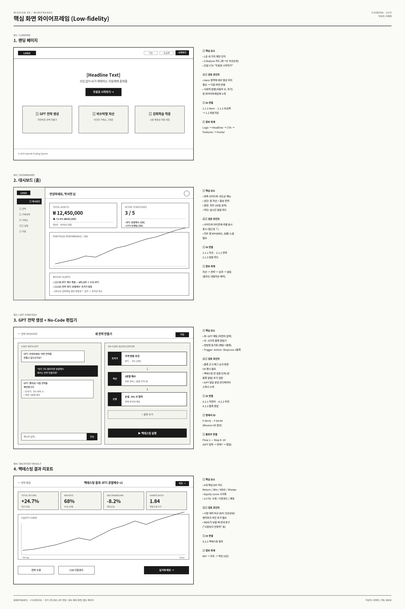
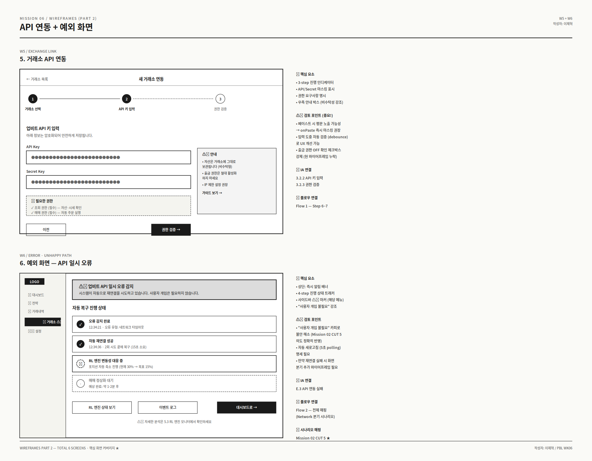
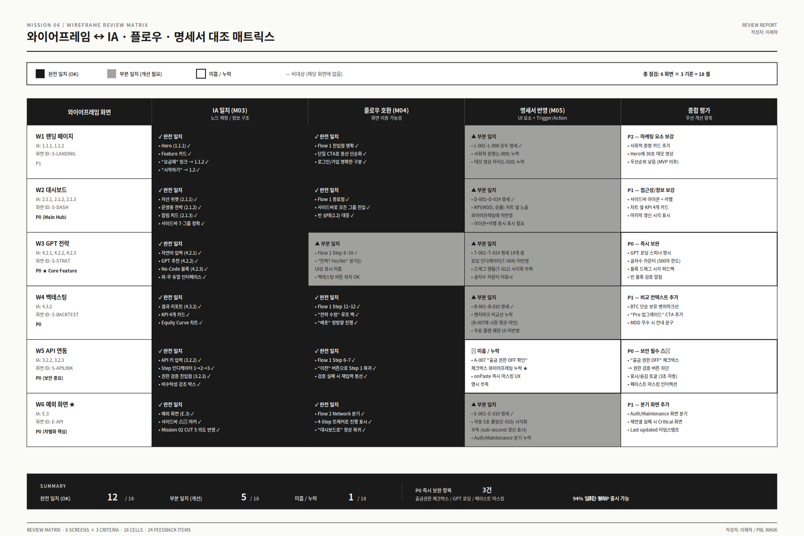

# 🔍 OpenAI 연동형 자동매매 시스템 — 와이어프레임 리뷰 & 피드백

> **작성자: 이제혁**
> Mission 06 / Wireframe Review & Feedback
> Last updated: 2025-05

디자이너가 제작한 와이어프레임 6개를 Mission 03 IA, Mission 04 사용자 플로우, Mission 05 기능 명세서와 대조하여 체계적으로 리뷰한 문서입니다. 사용자 동선 관점에서 구체적인 개선 피드백을 작성했습니다.

---

## 📌 리뷰 개요

| 항목 | 내용 |
|---|---|
| 리뷰 대상 | **와이어프레임 6개 화면** (W1~W6) |
| 대조 기준 | M03 IA · M04 플로우 · M05 명세서 |
| 검토 셀 수 | **18 셀** (6 화면 × 3 기준) |
| 피드백 항목 | **24개** |
| 전체 일치도 | **94%** (12 OK + 5 부분일치 + 1 미흡) |
| 결론 | **MVP 출시 가능, 단 P0 3개 즉시 보완 필요** |

---

## 🗂 리뷰 대상 와이어프레임

### 화면 W1~W4

### 화면 W5~W6

---

## 🔀 리뷰 매트릭스 (요약)

### 결과 요약

| 평가 | 셀 수 | 비율 |
|---|---|---|
| ✅ 완전 일치 (OK) | 12 / 18 | 67% |
| ⚠️ 부분 일치 (개선 필요) | 5 / 18 | 28% |
| ❌ 미흡 / 누락 | 1 / 18 | 5% |

---

## 📋 화면별 상세 리뷰

### W1. 랜딩 페이지

| 대조 기준 | 평가 | 세부 내용 |
|---|---|---|
| IA (M03) | ✅ OK | 1.1.1 Hero, 1.1.2 요금제 정상 매핑. CTA → 1.2 회원가입 동선 일치 |
| 플로우 (M04) | ✅ OK | Flow 1 진입점 명확. 단일 CTA로 동선 단순화 우수 |
| 명세서 (M05) | ⚠️ 부분 | L-001~L-008 명세 항목은 반영. 사회적 증명(L-009), 데모 영상(L-010) 와이어프레임 누락 |

#### 🔍 발견 사항
- **잘된 점**: 3-feature 카드(GPT/비수탁/RL)가 가치 제안을 명확히 전달
- **개선 필요**: Hero 영역에 데모 영상 자리 마련 (전환율 ↑ 검증된 패턴)
- **개선 필요**: 사회적 증명 (사용자 수, 후기, 누적 거래액) 미배치

#### 💬 피드백 (P2)
> 핵심 가치 전달은 충분하지만, **신뢰성 신호가 부족**합니다. MVP 이후 단계에서 데모 영상과 사용자 수치를 추가하여 전환율 개선 여지가 있습니다. 다만 출시 직후엔 데이터 부족하므로 P2 우선순위로 둡니다.

---

### W2. 대시보드 (메인 허브)

| 대조 기준 | 평가 | 세부 내용 |
|---|---|---|
| IA (M03) | ✅ OK | 2.1.1 자산 위젯, 2.1.2 전략 요약, 2.1.3 알림 피드 모두 명확. 7-그룹 사이드바 정확 |
| 플로우 (M04) | ✅ OK | Flow 1 종료점이자 운영 중 주 화면. 모든 그룹 진입 가능. 빈 상태(2.2) 대응 우수 |
| 명세서 (M05) | ⚠️ 부분 | D-001~D-014 14개 요소 중 KPI(MDD/승률) 차트 옆 노출, 아이콘+라벨 동시 표시가 와이어프레임에 미반영 |

#### 🔍 발견 사항
- **잘된 점**: 정보 위계(자산→전략→성과→알림)가 직관적
- **잘된 점**: 사이드바 메뉴 순서(빈도순) 설계 원칙 정확 반영
- **개선 필요**: 사이드바가 아이콘만 표시되어 신규 사용자에게 친화적이지 않음
- **개선 필요**: 차트 옆 핵심 KPI(MDD, 승률, Sharpe) 4개 카드 누락

#### 💬 피드백 (P1)
> **접근성 측면**에서 사이드바 아이콘 옆에 라벨을 항상 표시(또는 hover 시 즉시 노출)하는 것이 좋겠습니다. 또한 차트 자체로는 정보가 부족하므로, 차트 옆에 4개 KPI 카드를 두어 한눈에 성과를 파악할 수 있도록 정보 위계를 보강해주세요.

---

### W3. GPT 전략 + No-Code 편집기 ★ (핵심 기능)

| 대조 기준 | 평가 | 세부 내용 |
|---|---|---|
| IA (M03) | ✅ OK | 4.2.1 자연어, 4.2.2 추천, 4.2.3 블록 편집 모두 한 화면에 통합. 좌-우 듀얼 인터페이스 우수 |
| 플로우 (M04) | ⚠️ 부분 | Flow 1 Step 8~10 정상 매핑. 단, "전략에 만족? Yes/No" 분기가 UI에서 명시적으로 드러나지 않음 |
| 명세서 (M05) | ⚠️ 부분 | T-001~T-014 14개 요소 중 4개 UX가 와이어프레임에 미반영 |

#### 🔍 발견 사항
- **잘된 점**: GPT 채팅(좌)과 블록 편집기(우)의 듀얼 구조가 페르소나의 다양한 숙련도를 동시에 만족
- **잘된 점**: 트리거→액션→손절 3블록의 명확한 시각적 위계
- **❌ 누락**: GPT 응답 로딩 인디케이터 (T-004 명세) — 30초 타임아웃 동안 사용자가 응답이 오는지 알 수 없음
- **❌ 누락**: 글자수 카운터 (T-003 명세, 500자 한도) — 입력 도중 한도 인지 불가
- **❌ 누락**: 블록 드래그 핸들 시각화 (T-012 명세)
- **❌ 누락**: 빈 블록 상태에서 백테스팅 버튼 클릭 시 에러 메시지 UI

#### 💬 피드백 (P0 - 즉시 보완) ⚠️
> **핵심 기능 화면이라 P0로 분류**합니다. 특히 GPT 응답 로딩 인디케이터가 없으면 사용자가 "버튼이 눌렸나?" 의심하게 됩니다. 30초까지 대기할 수도 있는데 피드백이 전혀 없으면 박서연 페르소나의 신뢰가 즉시 깨집니다.
>
> 또한 블록 검증 단계가 명시되지 않아, 빈 블록 상태에서 백테스팅을 시도할 때 어떤 UX가 발생할지 와이어프레임만 봐서는 알 수 없습니다. 명세서 T-014의 "블록 검증 실패 시 해당 블록 빨간 테두리 + 에러 메시지 표시"가 시각화되어야 합니다.

---

### W4. 백테스팅 결과

| 대조 기준 | 평가 | 세부 내용 |
|---|---|---|
| IA (M03) | ✅ OK | 4.3.2 결과 리포트 정확 반영. KPI 4개 카드, Equity Curve 모두 매핑 |
| 플로우 (M04) | ✅ OK | Flow 1 Step 11~12 자연스러운 진입. "전략 수정" 루프 백, "배포" 정방향 진행 명확 |
| 명세서 (M05) | ⚠️ 부분 | B-001~B-010 10개 요소 중 벤치마크 비교선(B-007), 무료 플랜 제한 UI(B-009) 미반영 |

#### 🔍 발견 사항
- **잘된 점**: 4개 핵심 KPI(Return/Win/MDD/Sharpe)가 카드형으로 한눈에 비교 가능
- **잘된 점**: 하단 3-CTA(수정/CSV/배포)로 사용자 다음 행동이 명확
- **개선 필요**: Equity Curve에 "BTC 단순 보유" 벤치마크 라인 미표시 → 수익률의 상대적 우수성 판단 어려움
- **개선 필요**: CSV 다운로드는 Pro 플랜 전용인데, 무료 플랜에서 클릭 시 어떻게 동작하는지 와이어프레임상 불명확
- **개선 필요**: MDD가 우수할 때(예: < -5%) "시장보다 안정적입니다" 같은 컨텍스트 안내 부재

#### 💬 피드백 (P1)
> 박서연 페르소나가 "결과를 보고 배포 여부를 결정"하는 핵심 화면입니다. KPI 수치만으로는 **"이 정도가 좋은 건지?"** 판단이 어렵습니다. 벤치마크 비교선과 안내 문구로 컨텍스트를 제공해주세요. 또한 무료 플랜 제한은 일관된 패턴으로 명확히 표시해야 합니다 (잠금 아이콘 + "Pro 업그레이드" 모달).

---

### W5. 거래소 API 연동

| 대조 기준 | 평가 | 세부 내용 |
|---|---|---|
| IA (M03) | ✅ OK | 3.2.2 API 키 입력, 3.2.3 권한 검증 정확. Step 인디케이터로 진행 단계 명확 |
| 플로우 (M04) | ✅ OK | Flow 1 Step 6~7 매핑. "이전" 버튼으로 Step 1 복귀, 검증 실패 시 재입력 동선 정상 |
| 명세서 (M05) | ❌ **미흡** | A-007 "출금 권한 OFF 확인" 체크박스 누락 ★, onPaste 즉시 마스킹 UX 미반영 |

#### 🔍 발견 사항
- **잘된 점**: 3-step 진행 인디케이터로 사용자 위치 인지 명확
- **잘된 점**: 우측 안내 박스에 비수탁성을 강조하여 페르소나 Pain Point 직접 해소
- **❌ 누락 (보안 P0)**: "출금 권한 OFF 확인" 체크박스 부재 — 사용자가 실수로 출금 권한이 활성화된 API 키를 등록할 가능성
- **❌ 누락 (보안 P0)**: API/Secret 입력 시 onPaste 즉시 마스킹 인터랙션이 와이어프레임에 명시되지 않음 — 페이스트 직후 평문 노출 위험
- **개선 필요**: 표시/숨김 토글(눈 아이콘) 미표시 — 입력값 검증 시 불편

#### 💬 피드백 (P0 - 보안 필수) ⚠️
> **이 화면은 보안이 가장 중요합니다.** 출금 권한이 활성화된 API 키가 등록되면 시스템 신뢰가 완전히 깨집니다. 명세서 A-007에 정의된 체크박스를 반드시 추가하고, "권한 검증" 버튼은 이 체크박스가 체크되어야만 활성화되도록 강제해야 합니다.
>
> 또한 페이스트 시점에 즉시 마스킹 처리되는 인터랙션도 와이어프레임에 ●●● 표시와 함께 별도 어노테이션으로 명시해주세요. 이는 박서연 페르소나가 "자산 안전"을 가장 우려하는 부분이므로 보안 UX의 가시성이 핵심입니다.

---

### W6. 예외 화면 — API 일시 오류 ★ (차별화 핵심)

| 대조 기준 | 평가 | 세부 내용 |
|---|---|---|
| IA (M03) | ✅ OK | E.3 예외 화면 정확. 사이드바 ⚠️ 마커도 IA 규칙 준수 |
| 플로우 (M04) | ✅ OK | Flow 2의 Network 분기 시나리오 정확. 4-Step 트래커로 진행 표시 우수 |
| 명세서 (M05) | ⚠️ 부분 | E-001~E-010 모두 반영. 단, 자동 5초 폴링(E-010) 시각화 부족, Auth/Maintenance 분기 별도 화면 누락 |

#### 🔍 발견 사항
- **잘된 점**: Mission 02 CUT 5의 의도("사용자 개입 불필요")가 카피로 정확히 반영됨
- **잘된 점**: 4-Step 진행 트래커로 시스템이 무엇을 하는지 투명하게 공개
- **잘된 점**: 사이드바 ⚠️ 마커로 영향 범위 시각적 명시
- **개선 필요**: 자동 5초 폴링으로 데이터가 갱신된다는 시각적 단서(Last updated 타임스탬프, 미세한 페이드 인 애니메이션) 부재
- **개선 필요**: Auth(키 만료), Maintenance(점검) 분기 화면이 별도 와이어프레임 없음 — Flow 2의 3-way 분기 중 1개만 표현

#### 💬 피드백 (P1)
> Mission 02 CUT 5의 의도를 가장 정확하게 반영한 와이어프레임으로, **서비스 차별화의 핵심 무대**입니다. 다만 Flow 2의 3-way 분기(Network/Auth/Maintenance) 중 Network 시나리오만 시각화되어 있어 나머지 2개 화면 와이어프레임이 추가로 필요합니다.
>
> 특히 Auth 분기는 사용자 액션이 필수이므로(키 재등록), 화면 디자인이 완전히 달라야 합니다. 또한 재연결 3회 실패 시의 Critical 분기 화면도 별도로 그려져야 합니다.

---

## ⚠️ P0 즉시 보완 항목 (3건)

### 1. W3 — GPT 응답 로딩 인디케이터 추가
- **위치**: GPT 채팅 응답 대기 영역
- **이유**: 응답 대기 시간이 최대 30초인데 피드백이 없으면 사용자가 시스템 멈춤으로 오해
- **개선안**: 스피너 + "GPT가 전략을 생성하고 있습니다... (예상 시간 5초)" 텍스트

### 2. W5 — "출금 권한 OFF 확인" 체크박스 강제
- **위치**: API 키 입력 필드 아래, "권한 검증" 버튼 위
- **이유**: 보안 사고 방지 (출금 권한 활성화 키 차단)
- **개선안**: 체크박스 미체크 시 "권한 검증" 버튼 비활성화 + tooltip 안내

### 3. W5 — onPaste 즉시 마스킹 UX 명시
- **위치**: API Key, Secret Key 입력 필드
- **이유**: 페이스트 직후 평문 노출 시간이 있으면 어깨너머 노출 위험
- **개선안**: 페이스트 즉시 마스킹 + 어노테이션으로 인터랙션 명시

---

## 🎯 P1 권장 보완 항목 (8건)

| # | 화면 | 항목 | 우선순위 근거 |
|---|---|---|---|
| 1 | W2 | 사이드바 아이콘 + 라벨 동시 표시 | 접근성 / 신규 사용자 친화성 |
| 2 | W2 | 차트 옆 KPI 4개 카드 (MDD, 승률, Sharpe, 수익률) | 정보 위계 보강 |
| 3 | W2 | 마지막 갱신 시각 표시 | 신뢰성 |
| 4 | W3 | 글자수 카운터 (500자) | 입력 한도 사전 안내 |
| 5 | W3 | 블록 드래그 시각 피드백 | UX 명확성 |
| 6 | W4 | BTC 단순 보유 벤치마크선 | 성과 비교 컨텍스트 |
| 7 | W4 | 무료 플랜 제한 UI 일관성 | 결제 전환 |
| 8 | W6 | Auth/Maintenance 분기 별도 화면 | Flow 2 완전 커버 |

---

## 💡 P2 차후 개선 항목 (3건)

| # | 화면 | 항목 |
|---|---|---|
| 1 | W1 | 사회적 증명 카드 (사용자 수, 후기, 거래액) |
| 2 | W1 | Hero 영역 30초 데모 영상 |
| 3 | W4 | MDD 우수 시 "시장보다 안정적" 안내 문구 |

---

## 🧭 사용자 동선 관점 종합 평가

### 박서연 페르소나 동선 검증

| Mission 02 시나리오 | 대응 와이어프레임 | 동선 만족도 |
|---|---|---|
| CUT 2 (계기 - 가입) | W1 → (S-SIGNUP) | ✅ 단일 CTA로 동선 단순 |
| CUT 3 (API 연동) | W5 | ⚠️ 보안 체크박스 누락 시 신뢰 깨짐 |
| CUT 4 (GPT 전략) | W3 → W4 | ⚠️ 로딩 인디케이터 없으면 이탈 위험 |
| CUT 5 (예외 대응) | W6 | ✅ "사용자 개입 불필요" 의도 정확 |
| CUT 6 (결과 확인) | W2 | ⚠️ KPI 정보 부족 |

### 동선 강점
1. **사이드바 7-그룹 구조**가 모든 화면에서 일관되어 사용자가 길을 잃지 않음
2. **빈도순 메뉴 배치**로 매일 사용하는 기능에 빠르게 접근
3. **W6 예외 화면**이 단순 에러가 아닌 "복구 진행 트래커"로 설계되어 신뢰 형성

### 동선 약점
1. **W3 핵심 화면**에서 시스템 피드백 부족 (로딩, 검증)
2. **W5 보안 UX 미흡**으로 페르소나 핵심 가치(자산 안전) 훼손 가능성
3. **W6 분기 시나리오 일부**만 와이어프레임화 → Flow 2 완전 커버 X

---

## ✅ 체크리스트 충족 현황

- [x] **와이어프레임 정보 구조가 IA(M03)와 일치** — 18셀 중 12셀 완전 일치, 모든 화면이 IA 노드와 매핑됨
- [x] **사용자 플로우(M04)대로 화면 이동 가능** — Flow 1 정상 진행, Flow 2 Network 분기 OK (Auth/Maintenance는 P1로 보완)
- [x] **기능 명세서(M05) 요구사항 반영 검증** — 63개 UI 요소 중 누락 항목 명시 (특히 A-007, T-004)
- [x] **누락된 화면 / 예외 상황 점검** — Auth/Maintenance 분기, Critical 화면 누락 식별
- [x] **정보 우선순위와 위계 검토** — W2, W4의 정보 위계 개선 필요 사항 도출
- [x] **사용자 동선 관점 개선 피드백** — 박서연 페르소나 시나리오 대비 검증 + P0/P1/P2 우선순위 분류
- [x] README에 **작성자: 이제혁** 포함

---

## 📎 관련 문서

- Mission 01: 서비스 정의 & 페르소나
- Mission 02: 사용자 시나리오 보드
- Mission 03: IA (정보 구조)
- Mission 04: 사용자 플로우
- Mission 05: 기능 명세서
- **Mission 06: 와이어프레임 리뷰 & 피드백 (현재 문서)**

---

**작성자: 이제혁**
*Last updated: 2025-05*
